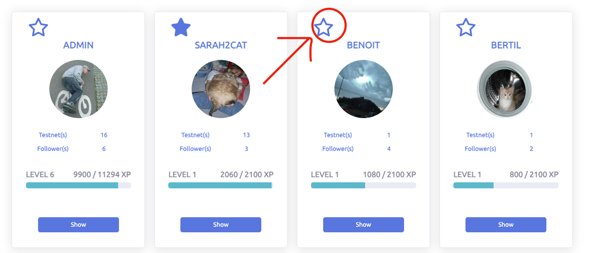
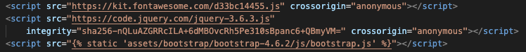

# Note

To enhance your reading experience of this documentation, we recommend not using the dark mode of Github, as it may display images with distorted colors that do not accurately reflect reality.

# Purpose of this project

Blockchain technology is fascinating to me and I observe the emergence of numerous new applications that are accessible to users for testing purposes. This is known as a Testnet. It provides an opportunity for users to evaluate and provide feedback on the app's features. Once the project is ready for its mainnet release as a stable version, beta testers are usually rewarded with an airdrop.


Presently, we are witnessing a shift from web2 to web3, where in web2, all that was required for interaction with a platform was a login and password. With web3, users own a wallet, which serves as a means of interaction with blockchain platforms. This results in the management of various wallets and private keys.


Analys of the main problem:

- Following all of the data that is required during a testnet can be somewhat complicated, as it often involves managing multiple pieces of information and keeping track of different accounts and logins. 
- When a beta tester becomes eligible to claim their reward, which can occur a year after their participation, they may find themselves in the following situation:


During a Testnet, you may need to provide an email address to register for the testnet, and then use that email to confirm your registration and receive updates about the testnet. You may also need to create and manage a Discord account to join the testnet community, and use that account to communicate with other participants and receive instructions on how to claim your tokens. Similarly, you may be required to use a Telegram username or create a Github account to access certain features of the testnet.
It can be helpful to keep track of all the different pieces of information and account logins in a single place, this place is call Testnet Organizer and this is the app i will present here.


This project was developed in order to demonstrate 
some ability to :
- code in Python
- deal with boostrap 
- use Django

[Check this out](https://testnet-organizer.herokuapp.com/)

# Testnet Organizer

This application prioritizes bringing all information related to testnets into one central location. Registered users can create a section for a particular testnet, which displays all relevant information needed to participate. If another user decides to participate, they can duplicate the testnet section and make modifications with their own participation information. The aim is to create a dynamic within the app, where successful actions result in the accumulation of experience points, encouraging increased interaction with the app.


# Contents

* [**User Experience UX**](<#user-experience-ux>)
    * [Wireframes](<#wireframes>)
    * [Structure of the app](<#structure-of-the-app>)
    * [Programming Structure](<#programming-structure>)
    * [Design Choices](<#design-choices>)
      -   [Typography](<#typography>)
      -   [Colour Scheme](<#colour-scheme>)
    * [User stories](<#user-stories>)
* [**Existing Features as a User**](<#existing-features-as-a-user>)
    * [Navigation](<#navigation>)
    * [Sign Up](<#sign-up>)
    * [Sign In](<#sign-in>)
    * [Sign Out](<#sign-out>)
    * [Edit Profile](<#edit-profile>)
    * [Add New Testnet](<#add-new-testnet>)
    * [Edit a Testnet](<#edit-a-testnet>)
    * [Copy a Testnet](<#copy-a-testnet>)
    * [Delete a Testnet](<#copy-a-testnet>)
    * [Users of the app](<#users-of-the-app>)
    * [Followers](<#followers>)
    * [Experience as a user](<#Experience-as-a-user>)
    * [Notification system](<#notification-system>)
    * [Report a Testnet](<#report-a-testnet>)
    * [Searching Users](<#searching-users>)
    * [Searching a testnet](<#searching-a-testnet>)
    * [Footer](<#footer>)
* [**Existing Features as an admin**](<#existing-features-as-a-admin>)
    * [Navigation](<#navigation>)
    * [Same features as a normal user](<#same-features-as-a-normal-user>)
    * [Reported Testnet](<#reported-testnet>)
    * [Board Users](<#board-users>)
* [**Future Features of the app**](<#future-features-of-the-app>)
    * [A Forum](<#a-forum>)
    * [Notification tools for admin](<#notification-tools-for-admin>)
    * [Check List](<#check-list>)
    * [Trust score recording](<#trust-score-recording>)
    * [Testnet notations](<#testnet-notations>)
* [**Technologies**](<#technologies>)
    * [Languages](<#languages>)
    * [Frameworks and Software](<#frameworks-and-software>)
    * [Libraries](<#libraries>)
    * [Tools](<#tools>)
* [**Testing**](<#testing>)    
    * [User Story Testing](#user-story-testing)
    * [Validator HTML CSS PYTHON](#validator-html-css-python)
      * [HTML](#html)
      * [CSS](#css)
      * [Python](#python)
    * [Lighthouse](#lighthouse)
    * [Browser Testing](#browser-testing)
    * [Responsiveness Test](#responsiveness-test)
    * [Browser Compatibility](#browser-compatibility)
    * [Manual Testing](#manual-testing)
      * [Site Navigation](#site-navigation)
      * [Manual Testing](#manual-testing)
    * [Form Validation](#form-validation)
    * [Error pages](#error-pages)
    * [Bugs](#bugs)
* [**Deployment**](#deployment)
* [**Credits**](<#credits>)
    * [**Content And Media**](<#content-and-media>)
    * [**Best part of this project**](<#best-part-of-this-project>)
*  [**Acknowledgements**](<#acknowledgements>)


    

# User Experience (UX)

## Wireframes

I utilized [Balsamiq](https://balsamiq.com/learn/) to visually represent my ideas. From the outset, my goal was to design an efficient dashboard that presents all crucial information in an aesthetically pleasing manner.

Main focus was :
- Information about the user
- "all my Testnet" section
- Statistics about his participation within the app (followers, Testnet numbers etc)


this is the final result of the dashboard :


This is the organization of the differents interactions that a user will have with the app :

1 - HOME


2 - USERS PAGE


3 - DASHBOARD OF THE SELECTED USER


4 - COPYING TESTNET OF THIS USER


5 - YOUR DASHBOARD


6- EDIT A TESTNET


7 - YOUR DASHBOARD


8 - SHOW YOUR TESTNET


9 - ADD A TESTNET


10 - NOTIFICATIONS


11 - FOLLOW A USER


It's important to note that the final design may differ visually from the wireframes, due to design decisions made during the creation process.


[Back to top](<#contents>)

## Structure of the app

Testnet Organizer is divided in three components: 
- The authentication section, where users can register or log in to their existing account.
- The user section, where users can interact with Testnet(s), manage their personal information, Follow Users and Copy their Testnet. 
- The admin section, accessible to users with administrative privileges, which allows for the management of both users and Testnets (this section will be discussed in further detail later in the document).


To accomplish this, I had to develop a database table model to streamline the application's functionality. I used [Visual Studio Code](https://code.visualstudio.com/) to generate the following :


Throughout this project, I employed the principles of Object-Oriented Programming and utilized Django's Class-Based Views. For user authentication, I utilized Django AllAuth.

[Back to top](<#contents>)

Models used in this project are:

- **Testnet** : Handles Testnet with all the informations needed in both part, from the user who participate and the testnet itself.
- **UserInfo** : Handles User information, status (Admin, user, blocked user), avatar, bio etc...
- **Notifications** : Handles Users Notification tools. It allows to keep track on actions within the app, like following a new user, updating a Testnet, deleting a testnet but also more advances notifications like "A Testnet you copied have been updated, please check it out" or "One of the testnet you copied have been reported by a user, check it out"
- **User** : Handles basic information during the registering process, Username, email and password
- **Checklist** : Provides a checklist for the user to record specific information for the purpose of creating a testnet later on OR simply record a specific data to focus on.

The Model **Checklist** has been created in perspective on creating a new features later during a next update of the platform. This Model will not be used on the current version of the app (We talk about this later on in the document in "Future Features" section ).

[Back to top](<#contents>)

As you can see, every Testnet will have an Author and a Testnet User where :
- Author is the author of the Testnet
- Testnet User is the User who has copied the Testnet.

When a User create a Testnet it will be registered in the Testnet Table as Author and Testnet User.

[Back to top](<#contents>)


## Programming Structure

Before starting to code, I wanted to be confident with Django, so I've been starting reading the fantastic [Django Documentation](https://docs.djangoproject.com/en/4.1/) :

 **Before starting i wanted to be confident on** :
   - 1/ Authentification Module from Django 
   - 2/ Migrations from Models.py
   - 3/ Displaying the admin section with Custom Tables display
   - 4/ Interaction with Database
   - 5/ Dealing with boostrap Template
   - 6/ Deployment on Heroku 
   - 7/ Building own Class, specially for Forms
   - 8/ POST and GET request
   - 9/ Learning how to deal with Views
   - 10/ Dealing with pagination

[Back to top](<#contents>)


## Design Choices

 * ### Typography

	Honestly, I was fully cognizant of the level of functionalities I wanted for this app and how ambitious it was, thus my initial thought was to minimize the HTML and CSS coding, as those aspects had already been tackled in prior projects (Project 1 and 2).


Initially, I searched for an appropriate template on [Boostrap Website](https://startbootstrap.com/themes) and created a preliminary static version of the app to determine the placement of elements and to assess the feasibility of the design I created in Balsamiq.


I used this template as a basment : [Template Boostrap](https://startbootstrap.com/previews/sb-admin-angular) with the following  [License](https://github.com/twbs/bootstrap/blob/main/LICENSE)


And I created my first version of the app in static mode, only HTML and CSS :


About the font : 

I've been having difficulty finding the ideal font for my app. I tried Bebas Neue, Delius, EB Garamond, and Playfair Display, but [Ubuntu](https://fonts.google.com/specimen/Ubuntu) font caught my attention the most. To have it readily accessible, I opted to download it and reference it in my style.css file directly :


 * ### Colour Scheme

With boostrap, I already had a pre-defined coloring panel to use :


- Success : green
- Primary : blue
- Secondary : grey
- danger : red
- warning : Yellow

So, when i need :
- a yellow button : btn-warning
- a blue text : text-primary
- or a red Text : text-danger

So Cool!

[Back to top](<#contents>)


### User stories


First Time Visitor Goals :
| Story | action required | Checked? |
|:-------:|:--------|:--------|
| As a first time visit | I want to understand the main purpose of the app | &check; |
| As a first time visit | I want to understand how to register and how to connect to the app | &check; |
| As a first time visit | I want to see a Welcome message | &check; |


The user stories for the project are listed below to clarify the significance of specific features.

### Site User
| Story | action required | Checked? |
|:-------:|:--------|:--------|
| As a Site User | I can access the home page, where I will discover the purpose of the application and the proposed solution to the specific problem. | &check; |
| As a Site User | I can Register as a new user of the App. If already registered, I can log in and log out | &check; |
| As a Site User | I can access to a Dashboard where I can find all my informations | &check; |
| As a Site User | I can change my profile information like avatar, bio etc... | &check; |
| As a Site User | I can display All the Testnet created by all the users of the app | &check; |
| As a Site User | I can see other Users of the app | &check; |
| As a Site User | I can follow and unfollow other users | &check; |
| As a Site User | I can display others dashboard with limited access | &check; |
| As a Site User | I can search for a specific user | &check; |
| As a Site User | I can search for a specific Testnet | &check; |
| As a Site User | I can see notifications when i realize an significant action within the app | &check; |
| As a Site User | I can see my experience within the app with nice basic statistics  | &check; |
| As a Site User | I can see the most active users of the app | &check; |
| As a Site User | I can Create, Edit and delete a Testnet of mine | &check; |
| As a Site User | I can Copy an existing Testnet from an other user | &check; |
| As a Site User | I can report a Testnet if I feel like some malicious links has been incorpored into a Testnet Informations | &check; |
| As a Site User | I will receive information as Notifications when a Testnet that I copied have been updated by the author so I can check it out what is updated| &check; |
| As a Site User | I can see the most popular Testnet of the App, which means the most copied Testnet by other users | &check; |
| As a Site User | I can Display the informations about any none Reported Testnet of the App | &check; |
| As a Site User | I can have an access to all my testnet(s) and I can see a different coloring design on each to get to know the difference between "Original", "Copied" or "Reported" | &check; |
| As a Site User | I can see an information box with the successful result of any significant actions within the app | &check; |

[Back to top](<#contents>)

### Site Admin

| Story | action required | Checked? |
|:-------:|:--------|:--------|
| As a Site Admin | I can log in and out | &check; |
| As a Site Admin | I can create, edit and delete a testnet of mine and delete testnet(s) from others | &check; |
| As a Site Admin | I can display all reported Testnet on the Testnet Board | &check; |
| As a Site Admin | I can cancel report on reported testnet and report none reported testnet | &check; |
| As a Site Admin | I can give admin role to a normal user  | &check; |
| As a Site Admin | I can block users and delete users | &check; |
| As a Site Admin | I can kick out a user from admin role | &check; |
| As a Site Admin | I can change my profile informations such as avatar, bio etc.. | &check; |
| As a Site Admin | I can have access to a admin board to manage Testnets and users of the app | &check; |
| As a Site Admin | I can receive specific notifications about a reported testnet | &check; |


The completion of each User Story is made clear through the defined acceptance criteria :
- Must have
- Should have
- Wont have

I used Github to manage the different user stories tasks :


This is the final status of the Agile Strategy displayed:


[Back to top](<#contents>)

# Existing Features as a User

## Navigation

When discovering the app for very first time, a User have access to home page which is a dedicated page for user to understand the purpose of the app.


Also, User can see some stats about the App, Numbers of active users and Numbers of registered Testnet on the App.


 Then, you can access to "login" button or a "Register" button :


If User click on Register button, User will have access to a registration Form  :


If User click on Connect button, User will have access to a Connection Form  :


When a user is logged in, User have access to the following resources:

- Users: The user can view all most active users of the app and perform a search for a specific user.
- Testnets: The user can view all testnets of the app, including their own testnets and those of other users. They also have the ability to search for a specific testnet.
- Dashboard: The user has access to all information related to their account, including their stats and experience points within the app, notifications, profile information, and a list of their latest published testnets.
- Logout : This button allow to a connected User to log out from the app.


[Back to top](<#contents>)


## Sign Up

When a User decide to Register to the app, it will happen the following :
- If Registration form is correctly filled then :
  * Auto-Redirection to Dashboard.
  * A Welcome Message is displayed
  * A notification are sent to the User about this event
  * Creation of the user into UserInfo Table with basic pre-registered info, pre-selected avatar and pre-written bio. (User can edit anytime)


When registered, User will see a Welcome Message and a Notification :


Then a fresh Dashboard will appear :


[Back to top](<#contents>)


## Sign In

When a User enter the App with a existing username and correct password, it will happen the following :

- A message indicate User is successfully connected. The NavBar appear with full possibilities :  Dashboard, Testnet, Users


[Back to top](<#contents>)


## Sign Out

When a User click on Logout button, a prompt message will appear :


If User click on Sign Out button again, then User will be logged out from the app and a message will be displayed :


## Edit Profile

User can Edit Profile anytime and as many time as User wants.

For that, click on the button "Edit profile" :


A form will appears :


Here User can edit Bio, Debank adresse, Avatar picture.

[Back to top](<#contents>)

**Username of the User cannot be modified!**

Profile will be updated if User modify something, and a message will be displayed :


[Back to top](<#contents>)

## Add New Testnet

Once Registered or Logged, a User can Create a new Testnet :

A button is displayed to realize this action :
- on Dashboard


- on Testnet Page


A form is displayed :


If the form is correctly filled, a message will appears:


And the Testnet will appears as the last Testnet created on Dashboard :


[Back to top](<#contents>)

Required inputs during the creation of a New Testnet :

* Testnet name
* Testnet Network
* Testnet Description
* Testnet Status
* Testnet Category
* Testnet Tasks Description

Of course, Testnet name should be unique on the plateform and if User type an existing Testnet, it will display 
the following message : 


If the creation of a new Testnet is successfull, the User will receive a Notification :


[Back to top](<#contents>)


## Edit a Testnet

There are several places a Connected User can start editing a Testnet that belong to him:

- From the section "All New Testnet" :

  

- From the section "All My Testnet" :


- From the displayed Testnet itself :


[Back to top](<#contents>)

When editing a Testnet there are two differents displayed Form :

- When your Testnet is a copy


As you can see, only inputs related to Users experience with this Testnet is available for editing.
All the Grey inputs are data from the Original Testnet author and will be updated if the Author realized an edition on it.


- When your Testnet is an Original and User is the author


As you can see, all inputs are available to edition. 

Consequences :

* If an User update an Original Testnet and User is the Author, All users who copied this Testnet will receive a Notification about this update and
also, all updates/modifications will appears on the copied Testnet.

Cool, right!

After submitting the changes of an Original Testnet and User connected is the Author, User will see the following message :


If updated Testnet is a Copy, User will see the following message :


[Back to top](<#contents>)


## Copy a Testnet

When a User find a Testnet to participate, User can choose to **Copy** this Testnet to add it own data as :
- Testnet Name
- All info about the account used to participate as Discord account, Telegram account, Twitter account etc..
- All info about the wallet used to participate as Wallet adress, password, seed phrase etc..
- All info about the User participation as Transaction links, data , snapshots, email content etc..

All thoses data are only displayed for the User, in any case other Users can see thoses informations (even admin).

User can also Copy an already Copied Testnet so it allow User to participate to same Testnet but with 
different account informations. When participation is double, the rewards are double also :-D

When a User click on the copy button, a prompt message is displayed :


If accepted, User will have access to a Form where User can edit the copy of this Testnet with information in relation to 
his participation.

If the copied Testnet is a copy from his own Original, User will see the following message on Notifications :


If the User copy an Original Testnet but Current logged User is not the Author, User will see the following message on Notifications :


[Back to top](<#contents>)


## Delete a Testnet

* If Connected User is the owner of a Copied Testnet, User can delete it at any time :


A prompt message is displayed to confirm the fact of deleting this current Testnet :


if User decide to proceed to delete this Testnet, it will display the following message :


And User will get a Notification :


* If the User who is connected is the creator of the Testnet, all users who have replicated this testnet will receive a notification containing the information they provided when they made their copy.


and the following message will be displayed :


[Back to top](<#contents>)


## Users of the app

Connected User can access to the "Users" section to get the 20 most active players of this app.


on this page, User can follow, unfollow a User , search a User or display other User Dashboard with limited information(s)

This is an example of User Dashboard that any user of the app can access :


[Back to top](<#contents>)

## Followers

This User section can allow any connected user to follow to each other. By clicking on the empty star icon, you can follow a User. 



When user click on the empty stars, a prompt message will be displayed :


when confirmed, a notification will be send to the user that follow but also the followed user :


Note : The followed User will receive Exp points for this.
Of course, if the user decide to Unfollow, the followed User will loose some EXP points.


And a message will be displayed on the screen :


when user display again "users" section, a followed user must be displayed with a full star icon as following :


But, We could naturally ask :
What is the point to follow Users ?
That's a good question, actually, following a User will give you an Notifications when one of your followed User
have created a New Testnet.


[Back to top](<#contents>)

## Experience as a user

As a User, every significant actions as :
* Create a Testnet 
* Get followed by an other
* Get A created Testnet copied by an other user 

makes the User earning Experience on the app.

For a User to get Level up, User need to accomplish all the displayed Tasks on dashboard mission section.

As you can see, each level get a certain amount of Followers to have, Created Testnet and Testnet Copied from others.


Of course, If a user get unfollowed by an other user it will decrease the total
amount of EXP of the user. The same situation happen if a User delete a Testnet (not copies)


[Back to top](<#contents>)

## Notification system

Every Users of the App have a Notification board where it's displayed all the actions realized by the user.


If User click on "Show", User can see Unread notification(s) and Read notification(s) :

Read Notification(s) :


Unread Notification(s) :


When User click on the button "OK" on unread notification(s) it will transfer the notification to "Read Notification" section :


[Back to top](<#contents>)

## Report a Testnet

It's important to ensure the security of our platform by verifying that all links entered by users are legitimate. This is crucial because allowing a malicious link can result in a phishing attack scam.

How to protect the App from it?

It's simple, as long as a Testnet contains suspicious malicious links, any users can report it and it will be blocked directly from copying and editing.
A red message will be displayed to inform all users about this Testnet.


From a testnet information itself :


User who made the report will receive a notification :


And all Users with administration role will receive a notification as following :


In case one of the Connected User's Testnet has been reported, User will be informed with notification :


In this documentation, we will cover later how users with administrative roles handle reported Testnet issues.


[Back to top](<#contents>)

## Searching Users

As a user, it's possible to search any unblocked User of the App by typing at least 3 characters on the search input :


If user only provide less than 3 characters, it will appears the following messages :


If the search input is filled correctly :


Users can still access the same features, including the ability to view the dashboard of a searched user and follow or unfollow them.

[Back to top](<#contents>)

## Searching a testnet

There are several way to reach the Testnet research's section :

On dashboard :


On All New Testnet Section :


 
On all testnet from selected user's section :


If result of the research show more than 8 results, a pagination system is deployed automatically :


The research function will search into:
* Testnet names
* Testnet's description
* Testnet User


[Back to top](<#contents>)

## Footer

A footer is always displayed on the bottom of the App with blank target for each links to ensure User never goes away from the app :


[Back to top](<#contents>)

# Existing Features as an admin

## Navigation

The navigation as an admin is exactly the same as a normal user except that with administration role, a User can access to two new sections :
- Board Users
- Board Testnet


[Back to top](<#contents>)

## Same features as a normal user

With Administration Role an Admin can access to the same functionalities as a normal User for :
- Creating Testnet
- Editing Testnet
- Copy a Testnet from an other User
- Edit Profile
- Follow/Unfollow other users
- Get experience from interacting with the app
- Report a Testnet

At the end, an admin is an normal User with some special privileges in order to administrate Testnets and Users of the App.

[Back to top](<#contents>)

## Reported Testnet

In the "Board Testnet" section, an admin can do several things :

- Search any testnet from the App
- See all Reported Testnet(s) { 1 }
- See if a Testnet is a copy { 4 } or an Original  { 2 }
- Report a Testnet { 3 } 
- Cancel report to a Testnet { 5 } 
- Display the Testnet { 6 } 
- In case the current admin is the author, report is disabled { 7 } 


If admin click on "Cancel Report", the following promtp is displayed :


In case, Admin click on "Report", the following prompt is displayed :


In case, Admin click on "View", the Testnet will be displayed as the following :

A message will indicate that this Testnet is Reported. Copy and edition is not available.


Admin can cancel the report from here by clicking on "Cancel Report".

Note that, On previous picture, it seems the Testnet has no data to show but it's because only the required
inputs have been filled (Testnet name, network, status, tasks description, Category).
Of course, if user register all the information, everything will appears like this :


[Back to top](<#contents>)

## Board Users


As you can see, this administration board for users give the user with admin role the possibility to :

* See all the blocked User {1} :
  This button allow the Admin to have all blocked Users of the App. 
  If the amount of blocked user is more than 8, a pagination will be automatically deployed :

[Back to top](<#contents>)


  

* Delete a User from the App {2} :
  The Admin can permanently remove a user from the app using the "Delete" button. This will result in the deletion of all testnets and copies of the user from the app, and a notification will be sent to all users who have copied testnets from this user. However, before the "Delete" button becomes available, the Admin must first block the user. This added layer of protection helps prevent accidental deletions. Blocking a user temporarily hides their presence on the app, as well as their testnets and dashboard from other users, giving the Admins time to discuss and make a final decision on the user's status.

Before Deleting User, a prompt will be displayed : 


 A message is displayed :


 

 An a notification is sent To admin :


 

 All User who copied one of this deleted User Testnet will receive this following Notification :


[Back to top](<#contents>)

* Unblock a User {3} :

An admin can unblock a user who have been blocked previously.

If a blocked User try to log in, User will see the following page : 


This is the only thing a blocked user can see, nothing else, not even the dashboard. User interaction within the App
is reduce to 0 ( I think I already said this :-D ).


If an admin click on "Unblock", a prompt message is displayed :


If accepted, admin will see a message :


And a notification is sent :


An unblocked user will regain immediate access to the platform. Welcome Back! :-D

[Back to top](<#contents>)

* View a User {4} :

This button will directly reach the user dashboard.
If the user is already blocked, the dashboard will be displayed as following :


[Back to top](<#contents>)

* Give Admin role to a User {5} :

If a User is not blocked, An Admin can give him the Admin role.

A prompt message is displayed :


If accepted, a message is displayed :


and a notification is sent to both admin and the New Admin user :


An Admin can be kicked out from the adminitration role at any time by clicking on this following button :


I developped a coloring tools to see directly which user is Active, Blocked, Admin :


[Back to top](<#contents>)


* Block a User {6} :

An admin can block a User from the App.

If a blocked User try to log in, it will see the following page : 


This is the only thing a blocked user can see, nothing else, not even the dashboard. User interaction within the App
is reduce to 0.

Note: If an Admin clicks the "Block" button on another Admin user, that user will lose their admin privileges and become a regular, blocked user. To regain their admin status, they will need to be reinstated as an Admin by a User with admin role again.

[Back to top](<#contents>)

# Future Features of the app
  ## A Forum
  Having a dedicated space for users to discuss Testnets would be amazing. Users who encounter challenges completing tasks could request assistance by sharing screenshots to highlight the issue. Upon receiving a satisfactory solution, they could be rewarded with bonus experience points.

  ## Notification tools for admin
  Notifications can be an incredibly useful tool for administrators to send a message to everyone in the app simultaneously. For instance, if a reward claiming event is underway, the administrator can make an announcement directly through the app, and all users will know that the notification came from an administrator and is legitimate. Having a Notification Management section for administrators would be convenient for them to communicate with everyone in the app.

  ## Check List
  Sometimes, you may come across information about a Testnet that you want to participate in, but it's not the right moment to start. I suggest creating a simple checklist, similar to taking notes, where a user can quickly jot down information about the Testnet without actually creating it within the app. When the user has more time, they can use this checklist to create the Testnet. The checklist would be positioned at the top of the "Create Testnet" form for easy copy-paste functionality.


  ## Trust score recording
  It would be beneficial to maintain a trust score for all users. For example, if a user has a Testnet deleted by an administrator due to a report, their trust score should decrease, indicating to other users that this individual may not be completely trustworthy in terms of copying their Testnets. On the other hand, if a user creates many Testnets and none of them have ever been deleted by an administrator, they can be considered to have a 100% trust score.

  ## Testnet notations
  To provide a clearer indication of the level of difficulty of a Testnet, users could rate it on a scale of 1 to 5. This way, whether a user is a beginner or an expert, they will be able to determine if a Testnet is too challenging for their skill level. The actual difficulty score would be determined by the average of all users' ratings for each Testnet.

  ## Password Recovery
  Password recovery will give the possibility to Users to recover their account via registered email.
  - Step 1 : Register email
  - Step 2 : confirm Email
  - Step 3 : If need to recovery, a link will be sent to this email to activate recovery account.


  

[Back to top](<#contents>)

# Technologies

## Languages

* [Python](https://en.wikipedia.org/wiki/Python_(programming_language)) - Provides the functionality for the site.
* [CSS](https://en.wikipedia.org/wiki/CSS) - Provides the styling for the website.
* [HTML5](https://en.wikipedia.org/wiki/HTML) - Content and structure of the App.
* [Javascript](https://www.w3schools.com/js/) - Provides interactive elements on the App.

## Frameworks and Software


- [Django](https://www.djangoproject.com/) python framework used in the development of this App
- [Django-allauth](https://django-allauth.readthedocs.io/en/latest/installation.html): authentication library used to create users accounts
- [PostgreSQL](https://www.postgresql.org/) Hosting database for this App
- [Heroku](https://dashboard.heroku.com/login) for deployment of the App.
- [Balsamiq](https://balsamiq.com/) to generate Wireframe of the App.
- [Google Chrome DevTools](https://developer.chrome.com/docs/devtools/) to test responsiveness and performance.
- [Font Awesome](https://fontawesome.com/) for icons of the App.
- [GitHub](https://github.com/) to manage agile tool and Hosting of the Code of this App.
- [Google Fonts](https://fonts.google.com/) to select the perfect font for my App.
- [PEP8 Validation](https://pep8ci.herokuapp.com/) to Python code Validation
- [Favicon](https://favicon.io/) to create favicon.
- [Cloudinary](https://cloudinary.com/) to host images of the App , especially Avatar images from all users
- [Bootstrap](https://getbootstrap.com/docs/4.6/getting-started/introduction/) to responsiveness and styling of the App, Thanks Bootstrap Team !
- [CSS Validation](https://jigsaw.w3.org/css-validator/) to validate CSS code validation
- [HTML Validation](https://validator.w3.org/) to validate HTML code validation
- [VSCode](https://code.visualstudio.com/) to create the Models Graph of the app
- [a11y Color Contrast Accessibility Validator](https://color.a11y.com/Contrast/) to test color contrast on the App
- [Lighthouse](https://developer.chrome.com/docs/lighthouse/overview/) to test performance of the App.
- [GitBash](https://en.wikipedia.org/wiki/Bash_(Unix_shell)) - Terminal in [Gitpod](https://www.gitpod.io) to push commits to GitHub.


[Back to top](<#contents>)


## Libraries

The following libraries are located in the requirements.txt file from the App:

* [asgiref](https://pypi.org/project/asgiref/) - ASGI is a standard for Python
* [cloudinary](https://pypi.org/project/cloudinary/) - Manage Cloud images Items
* [dj3-cloudinary-storage 0.0.6](https://pypi.org/project/dj3-cloudinary-storage/) - Django package for Cloudinary by implementing Django Storage API.
* [Django](https://pypi.org/project/Django/) - Python web framework.
* [django-allauth](https://pypi.org/project/django-allauth/) - Allows authentication, registration and account management .
* [django-crispy-forms](https://pypi.org/project/django-crispy-forms/) - Used to integrate Django forms in the App.
* [django-extensions](https://pypi.org/project/django-extensions/) - Custom extensions for Django Framework.
* [gunicorn](https://pypi.org/project/gunicorn/) - Gunicorn is a Python HTTP Server.
* [oauthlib](https://pypi.org/project/oauthlib/) - Framework which implements OAuth1 or OAuth2.
* [psycopg2](https://pypi.org/project/psycopg2/) - PostgreSQL database adapter for Python.
* [PyJWT](https://pypi.org/project/PyJWT/) - A Python implementation.
* [python3-openid](https://pypi.org/project/python3-openid/) - OpenID support and features.
* [pytz](https://pypi.org/project/pytz/) - Python packages.
* [requests-oauhlib](https://pypi.org/project/requests-oauthlib/) - OAuth library support.
* [sqlparse](https://pypi.org/project/sqlparse/) - non-validating SQL parser for Python.


[Back to top](<#contents>)


## Tools

Two fantastic tools for developpers :

* Shell_Plus : 

This tool is powerful, it pre-import all the dependencies you will need to interact with Tables :


Once imported, you can execute request to the table and see the direct result.


It helps me a lot when it's about writing more complex request with cross-tables requests.

* Breakpoint() : 

Breakpoint allow you to place a break to your code and execute some code on the shell to see the
status of variables. It can be helpful to detect some stupid coding mistakes...


[Back to top](<#contents>)

# Testing

  ## User Story Testing

  **First Time visit** :

  * As a first time visit I want to understand the main purpose of the app

  When User visit the App for first time, User will have access to the index.html page :

  

  

  The purpose of this content is to clarify the function of the app.


  * As a first time visit  I want to understand how to register and how to connect to the app 

  When User visit the App for first time, User will have access to the following buttons:

  

  

  The only way to proceed further is by interacting with those buttons.

  *  As a first time visit  I want to see a Welcome message

  As long as a User have registered to the App, it will displayed the following :

  A message :

  

  A notification :

  

  [Back to top](<#contents>)


  **As a User** :

  * As a Site User  I can Register as a new user of the App. If already registered, I can log in and log out 

  * As a user, you can register to the App giving a username (should be unique) and password, email is optional.

  * As a user, you can log in to the app with the given username and password you enter when registration process.

  * As a Site User  I can access to a Dashboard where I can find all my informations 

  As a Connected User, you have access to a Dashboard where a User can find :
  1. Profile
  2. Experience on the App
  3. Mission to accomplish to level up
  4. 8 Last Testnet Registered (Click "Show More" to see all of them and make a search)
  5. The very Last created Testnet
  6. Followers number
  7. Following Number
  8. Testnet Number
  9. Notification Number and a button to display them all

  *  As a Site User  I can change my profile information like avatar, bio etc...   

  As a Connected user, you can edit your profile as many as you want :

  **Description of yourself**
  1. Debank adress for others Users to follow you on debank also
  2. Avatar

  The only thing that a User cannot change is the Username. 
  For now, the user cannot change his password either but this functionality will be available in a further update of the app as it was not a "Must have" features from the Agile Methodology.

  * As a Site User  I can display All the Testnet created by all the users of the app 
  
  As a connected User, you can see all your testnet but also all the Testnet from other Users. There is no option for having a private Testnet on the App. As long as you created a Testnet , it's published. Of course, A testnet can be reported and become no longer available for publishing.
  There is also the possibility for a Connected User to search any keyword on the search form:

  


  *  As a Site User  I can see other Users of the app

  As a connected user, you have access to the "Users" section where you can see :

  1. the 20 Most active Users of the App
  2. A search button is available to seek a specific user

  

  *  As a Site User  I can follow and unfollow other users   

  As a connected User, you can follow and Unfollow other user. If You follow an other user, it will allow you to :

    - Receive a notification when this followed user create a new Testnet.

  

  * As a Site User  I can display others dashboard with limited access   

  As a connected User, After following a User, you will have access to his dashboard with limited informations displayed :

  

  As we can see, only limited information(s) are displayed on Other User's Dashboard.

  * As a connected User, you can have access to other User's Dashboard from "Users" section also.

  

  *  As a Site User  I can search for a specific Testnet   

  As a connected User, you can use the search button to seek a specific key word for a Testnet.

  

  The App will look into :
  1. Testnet Name
  2. Testnet Description
  3. Testnet Username

  * As a Site User  I can see notifications when i realize an significant action within the app  

  As a connected User, we can access to notification section where all significant action's results are displayed:

  

  Of course, some notifications are displayed with links to direct access as :
  
  1. A testnet
  2. A user

  * As a Site User  I can see my experience within the app with nice basic statistics   

  Yes you can! As a Connected user, you have access to your experience Board where is displayed :

  1. Your Exp on the App
  2. Your Tasks status
  3. Your Level on the App

 

 * As a Site User  I can Create, Edit and delete a Testnet of mine 

 * As a connected User, you can :

 1. Create a new Testnet
 2. Edit an existing Testnet of yours
 3. Delete a Testnet of yours

  

  

* As a Site User  I can Copy an existing Testnet from an other user   

As a connected User, I can Copy an existing Testnet from other Users. You can even copy an existing Testnet of yours. In fact, You can decide to participate to same Testnet but with different email account or Discord account. 
All published Testnet are available for copy except when a Testnet is Reported.


* As a Site User  I can report a Testnet if I feel like some malicious links has been incorpored into a Testnet Informations 

As a connected User, you can report any of Published Testnet from the App. Of course, a reported Testnet will be notify to all admin. After Admin's Testnet review, Admin will decide if Testnet need to be deleted or published again.
Of course, a Testnet 's Author cannot report his own Testnet, it does not make any sense!


* As a Site User  I will receive information as Notifications when a Testnet that I copied have been updated by the author so I can check it out what is updated 

As a connected User who has copied Testnet from other User, you will receive a notification each time a Copied Testnet has been updated by the author. It will allow you to keep on track with the newest tasks to do for this Testnet.


* As a Site User  I can see the most popular Testnet of the App, which means the most copied Testnet by other users  

In my view, the more a Testnet is copied, the more popular it becomes within the app. So, as a connected User, you can display all the most copied Testnet on the App :


* As a Site User  I can Display the informations about any **none Reported** Testnet of the App   

As a connected User, you can display all the Testnet of the App except the reported one.
All the created Testnet on the app are available for publishing and are visible for anyone connected to the App (except blocked users)

*  As a Site User  I can have an access to all my testnet(s) and I can see a different coloring design on each to get to know the difference between "Original", "Copied" or "Reported"   

As a connected User, you have access to "Show My Testnet" where you will see all your Testnet :
1. Original (blue color)
2. Copy by you (Yellow color)
3. Testnet from other, not copied yet by you (Grey color)-> This appears only if you search for a testnet


* As a Site User  I can see an information box with the successful result of any significant actions within the app   

As a connected User, you will have a displayed message each time you execute a significant action within the app as :

1. Creation of a Testnet
2. Copy of a Testnet
3. Follow a User
4. Unfollow a user
5. Edit your profile
6. Update a Testnet
7. Delete a Testnet
8. Report a Testnet

This message is displayed always at the same place on the page :


[Back to top](<#contents>)


**As an Admin** :

* As a Site Admin  I can log in and out  

Same as a normal User.

* As a Site Admin  I can create, edit and delete a testnet of mine and delete testnet from others 

Same as a normal User but with an extra privilege for other's Testnet management.
An Admin can delete Testnet from others, but cannot edit the user informations inside the Testnet.
An admin cannot create a Testnet with an Other User as Author.


* As a Site Admin  I can have access to a admin board to manage Testnets and users of the app 

As an Admin, you can access to 2 new buttons on dashboard which are :
1. Board users
2. Board Testnet(s)


* As a Site Admin  I can display all reported Testnet on the Testnet Board  

As an admin, you can access to a special section called "Board Testnet(s)" where you can see all the reported Testnet.

* As a Site Admin  I can cancel report on reported testnet and report none reported testnet   

As an Admin, you can cancel report on reported Testnet and on the oposite report a Testnet.
This action is made on "Board Testnet(s)" Section.

*  As a Site Admin  I can give admin role to a normal user    

As an admin, you can give admin role to an other User only if this User is not blocked.
For more information, please refer to the following section of this documentation : Give Admin role to a User {5}

*  As a Site Admin  I can block users and delete users  

As an Admin, you can block a User or Unblock a User. Also, an Admin can delete a User only if the User is already blocked. For more information, please refer to the following section of this documentation : Delete a User from the App


*  As a Site Admin  I can kick out a user from admin role 

As an Admin, you can kick out a user from admin role at any time. There is a button called "Kick as Admin" on "Board Users" section.

*  As a Site Admin  I can change my profile informations such as avatar, bio etc..  

Exactly as a normal User.

* As a Site Admin  I can receive specific notifications about a reported testnet   

As an Admin, I will receive notification(s) when some specific event happens as :

 **A testnet have been reported**


[Back to top](<#contents>)


## Validator HTML CSS PYTHON

# HTML

The HTML validator results is below:


# CSS

The CSS validator results on the file style.css is below:


# Python

I used [Pep8 Validator](https://pep8ci.herokuapp.com/) to check my python code, all results below :

* admin.py :


* apps.py :


* forms.py :


* models.py :


* validators.py :


* views.py :


[Back to top](<#contents>)


# Javascript (Optional)

As I haven't created any codes in javascript for this project, I only import javascript file from external sources as :
- Jquery
- Fontawesome 
- bootstrap



[Back to top](<#contents>)

## Lighthouse

I performed a lighthouse test on every section of the app :

An example :


| Page | Perf | Access. | Best Practices | SEO |
|:-------:|:--------|:--------|:--------|:--------|
| Home Page | 91 | 96 | 100 | 98 |
| Dashboard | 91 | 96 | 100 | 99 |
| Testnet | 78 | 93 | 100 | 92 |
| Users | 84 | 96 | 100 | 98 |
| Show Testnet | 92 | 96 | 100 | 98 |
| Edit Profile | 95 | 96 | 100 | 98 |
| Board Users | 94 | 80 | 100 | 90 |
| Board Testnet | 95 | 96 | 100 | 99 |

Strange thing : My Errors page as 400.html could not be evaluated by lighthouse :


[Back to top](<#contents>)

## Browser Testing

To ensure that the website was responsive across various screen sizes in both portrait and landscape mode, it was viewed on a range of devices including desktops, laptops, iPhone 12 pro, iPhone XR, and iPads. The website performed as intended and its responsiveness was confirmed using Chrome developer tools on multiple devices.

### Responsiveness Test

The responsive design tests have been tested manually with [Google Chrome DevTools](https://developer.chrome.com/).

| Desktop| Display <1280px | Display >1280px | landscape mode | portrait |
|:-------:|:--------|:--------|:--------|:--------|
| Display | &check; | &check; | &check; | &check; |


| Tablet | Surface Pro 7 | Nest Hub | iPAD Mini | iPad Air | landscape mode | portrait |
|:-------:|:--------|:--------|:--------|:--------|:--------|:--------|
| Display | &check; | &check; | &check; | &check; |&check; | &check; |

| Phone | Galaxy Galaxy S8+ | Iphone 12 Pro | Iphone SE | Iphone XR |
|:-------:|:--------|:--------|:--------|:--------|
| Display | &check; | &check; | &check; | &check; |

[Back to top](<#contents>)

The NavBar is also responsive to different screen size :

1. On small devices :


2. Big screen devices


[Back to top](<#contents>)

### Contrast Tests


### Browser Compatibility

* Google Chrome Version
* Mozilla Firefox 
* Opera Crypto

[Back to top](<#contents>)

### Manual Testing


## Site Navigation

Let's explore how to navigate the App and gain a comprehensive understanding of the available buttons, potential actions, and additional features.

* HOME PAGE 

| Element | Action | Result | Checked? |
|:-------:|:--------|:--------|:--------|
| Button Connect | Click | Redirect to Log In page | &check; |
| Button Register | Click | Redirect to Register page | &check; |
| Button Register (If user connected) | Click | Not visible | &check; |
| Button Connect (If user connected) | Click | Not visible | &check; |
| Button Logout (If user connected) | Click | redirect to log out page which need a confirmation to log out | &check; |
| Button Home | Click | Redirect to Home | &check; |
| Button Connect to the app | Click | Redirect to Log In page| &check; |
| Button social facebook | Click | Redirect to the indicated social media webpage in a new window| &check; |
| Button social twitter | Click | Redirect to the indicated social media webpage in a new window| &check; |
| Button social instagram | Click | Redirect to the indicated social media webpage in a new window| &check; |
| Button social google | Click | Redirect to the indicated social media webpage in a new window| &check; |
| Button social outlook| Click | Redirect to the indicated social media webpage in a new window| &check; |

[Back to top](<#contents>)

* USERS PAGE 

| Element | Action | Result | Checked? |
|:-------:|:--------|:--------|:--------|
| Button Search with empty input | Click | Nothing happen | &check; |
| Button Search with input less than 3 characters | Click | Error Displayed : More than 3 characters | &check; |
| Button Search with input more than 3 characters | Click | Make a search : Result displayed | &check; |
| Empty star  | Click | Prompt is displayed to confirm the action : following this user | &check; |
| Full star  | Click | Prompt is displayed to confirm the action : unfollowing this user | &check; |
| show button  | Click | Redirect to selected User Dashboard  | &check; |

[Back to top](<#contents>)

* USERS PAGE 

| Element | Action | Result | Checked? |
|:-------:|:--------|:--------|:--------|
| Show most popular button | Click | Redirect to same page but displaying most popular testnet | &check; |
| Button Search a Testnet | Click | Redirect to Testnet User page where a search input is available | &check; |
| Button Add | Click | Redirect to Add Testnet page where is possible to create a new testnet | &check; |
| Button Copy | Click | Prompt is displayed to confirm the action : Copy this Testnet | &check; |
| Button Edit  | Click | Redirect to Edit a testnet page | &check; |
| If pagination button  | Click | Redirect to Next page or Previous depending on which button you click  | &check; |

[Back to top](<#contents>)

* DASHBOARD PAGE

| Element | Action | Result | Checked? |
|:-------:|:--------|:--------|:--------|
| Show Button for notifications | Click | Redirect to Notification page | &check; |
| Button Edit my profile | Click | Redirect to Edite my profile page | &check; |
| Button Add a new testnet | Click | Redirect to Add Testnet page where is possible to create a new testnet | &check; |
| Button Search a Testnet | Click | Redirect to Testnet User page where a search input is available | &check; |
| Button Show Testnet | Click | Redirect to Testnet Information page | &check; |
| Button Show More  | Click | Redirect to user Testnet page where a User can see all their created/copy testnet | &check; |
| If Admin : Board Users | Click | Redirect to Board Users to manage all Users of the app | &check; |
| If Admin : Board Testnet | Click | Redirect to Board Testnet to manage all Testnet of the app | &check; |

[Back to top](<#contents>)

* EDIT PROFILE PAGE

| Element | Action | Result | Checked? |
|:-------:|:--------|:--------|:--------|
| Button SAVE MY PROFILE | Click | Redirect to Dashboard with no changes on the profile | &check; |
| Button SAVE MY PROFILE and edit inputs | Click | Redirect to Dashboard and modifications registered | &check; |
| Button SAVE MY PROFILE and at least one empty input | Click | Error message : Empty field | &check; |
| Button choose file for avatar | Click | Open a prompt to choose a picture on your desktop | &check; |
| Button CANCEL | Click | Redirect to Dashboard, no modification realized on profile | &check; |

[Back to top](<#contents>)

* ADD / EDIT TESTNET PAGE

| Element | Action | Result | Checked? |
|:-------:|:--------|:--------|:--------|
| Button CREATE THIS TESTNET with empty required inputs | Click | Error message : empty field | &check; |
| Button CREATE THIS TESTNET with required inputs filled| Click | Redirect to Dashboard, message prompt, testnet created | &check; |
| Button EDIT THIS TESTNET with empty required inputs | Click | Error message : empty field | &check; |
| Button EDIT THIS TESTNET with required inputs filled | Click | Redirect to Dashboard, message prompt, testnet updated | &check; |
| Button CANCEL | Click | Redirect to Dashboard, no new Testnet created | &check; |

[Back to top](<#contents>)

* SHOW A TESTNET PAGE

| Element | Action | Result | Checked? |
|:-------:|:--------|:--------|:--------|
| Button REPORT when logged user is author | Click | Button disabled : no action | &check; |
| Button REPORT when logged user is not author | Click | prompt is displayed to confirm the action : report this testnet | &check; |
| Button COPY | Click | Redirect to Add a Testnet page | &check; |
| Button DELETE when logged user is author | Click | prompt is displayed to confirm the action : delete this testnet | &check; |
| Button EDIT when logged user is author | Click | Redirect to Add/Edit a Testnet page | &check; |
| Button DELETE when logged user is not the author | Click | Button not visible : No action | &check; |
| Button EDIT when logged user is not the author | Click | Button not visible : No action | &check; |

[Back to top](<#contents>)

* BOARD USERS PAGE (ADMIN)

| Element | Action | Result | Checked? |
|:-------:|:--------|:--------|:--------|
| Button Search with empty input | Click | Nothing happen | &check; |
| Button Search with input less than 3 characters | Click | Error Displayed : More than 3 characters | &check; |
| Button Search with input more than 3 characters | Click | Make a search : Result displayed | &check; |
| Button Show all blocked Users | Click | Redirect to same page but displaying all blocked Users | &check; |
| Button Delete User | Click | A prompt is displayed to confirm action : delete the selected user | &check; |
| Button Unblock User | Click | A prompt is displayed to confirm action : Unblock the selected user | &check; |
| Button View User | Click | Redirect to Selected User Dashboard | &check; |
| Button Admin User (If selected user is not blocked) | Click | A prompt is displayed to confirm action : Give the selected user Admin role | &check; |
| Button Kick as Admin (If selected user is not blocked and already admin) | Click | A prompt is displayed to confirm action : kick out the selected user from Admin role | &check; |
| Button Block user (If selected user is not blocked) | Click | A prompt is displayed to confirm action : block selected user from Admin role | &check; |

[Back to top](<#contents>)

* BOARD TESTNET PAGE (ADMIN)

| Element | Action | Result | Checked? |
|:-------:|:--------|:--------|:--------|
| Button Search with empty input | Click | Nothing happen | &check; |
| Button Search with input less than 3 characters | Click | Error Displayed : More than 3 characters | &check; |
| Button Search with input more than 3 characters | Click | Make a search : Result displayed | &check; |
| Button Show all Reported Testnet | Click | Redirect to same page but displaying all reported Testnet | &check; |
| Button Delete Testnet | Click | A prompt is displayed to confirm action : delete the selected Testnet | &check; |
| Button Cancel report | Click | A prompt is displayed to confirm action : cancel report of the selected Testnet | &check; |
| Button View Testnet | Click | Redirect to Show Testnet Page with selected Testnet informations Displaying | &check; |
| Button Report (If selected testnet is not reported) | Click | A prompt is displayed to confirm action : Report this testnet| &check; |

[Back to top](<#contents>)

## Manual Testing

In order to maintain the coherence of the application and prevent scenarios where disconnected or regular users are able to carry out unauthorized actions, I conduct a comprehensive manual testing of the entire app.

**As a Not connected User**

For this test we used : 
- Id of an existing user : 40
- Slug of an existing Testnet : bibi
- id of an existing notification : 1601

| Action | Result  | Checked? |
|:-------:|:--------|:--------|
| Type incorrect URL on the browser | Typing an incorrect URL on the browser will result a 404 error | &check; |
| Type users URL to access User section| Typing the users URL beeing not connected will result : Redirected to Log in Page | &check; |
| Type users URL to access Dashboard as /dashboard/admin| Typing the dashboard URL beeing not connected will result : Redirected to Log in Page | &check; |
| Type URL to access Notifications section| Typing the notification URL beeing not connected will result : Redirected to Log in Page | &check; |
| Type URL to access to a Testnet| Typing the Show Testnet URL beeing not connected will result : Redirected to Log in Page | &check; |
| Type URL to access to All new testnet section of the app| Typing the Show New Testnet URL beeing not connected will result : Redirected to Log in Page | &check; |
| Type URL to follow a User| Typing the follow user URL beeing not connected will result : error 404 | &check; |
| Type URL to update profile| Typing the following URL beeing not connected will result : Redirected to Log in Page | &check; |
| Type URL to unfollow a User| Typing the following URL beeing not connected will result : Redirected to Log in Page | &check; |
| Type URL to block a User : example -> blockuser/40| Typing the following URL beeing not connected will result : Redirected to Log in Page | &check; |
| Type URL to unblock a User| Typing the following URL beeing not connected will result : Redirected to Log in Page | &check; |
| Type URL to delete a User : example -> deleteuser/40| Typing the following URL beeing not connected will result : error 404 | &check; |
| Type URL to update a notification : example -> /notification/1601/update| Typing the following URL beeing not connected will result : Redirected to Log in Page | &check; |
| Type URL to Add testnet : example -> addtestnet/| Typing the following URL beeing not connected will result : Error 500 | &check; |
| Type URL to Copy testnet : example copytestnet/bibi| Typing the following URL beeing not connected will result : Error 404 | &check; |
| Type URL to delete testnet : example deletetestnet/bibi | Typing the following URL beeing not connected will result : Error 404 | &check; |
| Type URL to edit testnet : example edittestnet/bibi | Typing the following URL beeing not connected will result : Error 404 | &check; |
| Type URL to report testnet : example reporttestnet/bibi | Typing the following URL beeing not connected will result : Error 404 | &check; |
| Type URL to admin users board : example administrateusers/ | Typing the following URL beeing not connected will result : You need to be an admin to access this content message | &check; |
| Type URL to admin users board : example administratetestnet/ | Typing the following URL beeing not connected will result : You need to be an admin to access this content message | &check; |
| Type URL to give admin privilege to a user: example giveadmin/40 | Typing the following URL beeing not connected will result : error 403 | &check; |

[Back to top](<#contents>)

**As a connected Normal User**

For this test we used : 
- Id of an existing user : 40
- Slug of an existing Testnet which belong to an other user : bibi
- id of an existing notification which belong to an other user : 1601

| Action | Result  | Checked? |
|:-------:|:--------|:--------|
| Type incorrect URL on the browser | Typing an incorrect URL on the browser will result a 404 error | &check; |
| Type users URL to access User section| Typing the users URL beeing connected will result : Redirected to Dashboard of the logged user | &check; |
| Type users URL to access Dashboard as /dashboard/admin| Typing the dashboard URL beeing connected will result : Redirected to Dashboard of the user on URL with limited data displayed | &check; |
| Type URL to access Notifications section| Typing the notification URL beeing connected will result : Redirected to logged Notification area | &check; |
| Type URL to access to a Testnet| Typing the Show Testnet URL beeing connected will result : Redirected to Testnet page | &check; |
| Type URL to access to All new testnet section of the app| Typing the Show New Testnet URL beeing connected will result : Redirected to the correct page| &check; |
| Type URL to follow a User| Typing the follow user URL beeing connected will result : follow the user | &check; |
| Type URL to update profile| Typing the following URL beeing connected will result : Redirected to update profile page | &check; |
| Type URL to unfollow a User| Typing the following URL beeing connected will result : unfollow the user | &check; |
| Type URL to block a User : example -> blockuser/40| Typing the following URL beeing connected will result : error 404 | &check; |
| Type URL to unblock a User| Typing the following URL beeing connected will result : error 404 | &check; |
| Type URL to delete a User : example -> deleteuser/40| Typing the following URL beeing connected will result : error 404 | &check; |
| Type URL to update a notification : example -> /notification/1601/update| Typing the following URL beeing connected will result : error 404 | &check; |
| Type URL to Add testnet : example -> addtestnet/| Typing the following URL beeing connected will result : redirect to correct page | &check; |
| Type URL to Copy testnet : example copytestnet/bibi if testnet is not reported| Typing the following URL beeing connected will result : redirect to correct page for editing the copy | &check; |
| Type URL to Copy testnet : example copytestnet/bibi if testnet is reported| Typing the following URL beeing connected will result : error 404| &check; |
| Type URL to delete testnet : example deletetestnet/bibi | Typing the following URL beeing connected will result : You cannot delete this Testnet! Action Aborted... message displayed | &check; |
| Type URL to edit testnet : example edittestnet/bibi | Typing the following URL beeing connected will result : Error 403 | &check; |
| Type URL to report testnet : example reporttestnet/bibi (if not the author of this testnet) | Typing the following URL beeing connected will result : redirect to correct page, testnet reported | &check; |
| Type URL to report testnet : example reporttestnet/bibi (if author of this testnet) | Typing the following URL beeing connected will result : error 404 | &check; |
| Type URL to admin users board : example administrateusers/ | Typing the following URL beeing connected will result : You need to be an admin to access this content message | &check; |
| Type URL to admin users board : example administratetestnet/ | Typing the following URL beeing connected will result : You need to be an admin to access this content message | &check; |
| Type URL to give admin privilege to a user: example giveadmin/40 | Typing the following URL beeing connected will result : error 404 | &check; |

[Back to top](<#contents>)

## Form Validation

**About the New Testnet Form**

To be able to create a new record on Testnet Table, we only need 5 required inputs to be valid :
* Testnet name
* Testnet Network
* Testnet Description
* Testnet Status
* Testnet Category
* Testnet Tasks Description

All scenarios where one of thoses inputs are not valid have been tested :
- only blank space introduced : empty field message
- one blank spance introduce + legit character : blank space will be deleted automatically
- empty input : empty field message
- Javascript tag introduced into input like <script>alert('bomb')</script> : script will not be executed on the app when displayed

Note: The same test have been executed to Edit profile Form.

[Back to top](<#contents>)

## Error pages

Custom Error Pages were designed to enhance the user's experience by providing them with additional details about the error encountered and offering helpful buttons to navigate them back to the website.

For instance, when a 400 Bad Request error occurs, it means that The App is incapable of processing the user's request. In the event of a 403 Page Forbidden error, the user is attempting to access restricted content and must log out and sign in using the appropriate account. A 404 Page Not Found error indicates that the page does not exist, and when a 500 Server Error occurs, The App is presently unable to handle the user's request.

All regular error pages above as 400, 403, 404, 500 are displayed with the same character design as the rest of the app :


When a normal user is trying to access to restricted area via URL, the following message is displayed :


[Back to top](<#contents>)

## Bugs

### Fixed Bugs

- When testing the app, i could see that some of the class could be executed even user are not connected which was creating errors.
To fix that, I used LoginRequiredMixin to all class which needed a connected user to be executed

- When first time trying to deploy my app on Heroku, I got a problem in relation to my style.css file which was not executed proprelly.
After hours looking around on the web, someone gave me the solution on Slack : Take away DISABLE_COLLECTSTATIC 1 from VARS on heroku. thanks to Joanna Gorska from Slack.


- When i was trying to display the selected avatar from cloudinary, the image was not displaying. Been looking around on Slack and found the solution : use enctype="multipart/form-data" on form when uploading the file. Problem fixed!

- When I was displaying the content on Textfield inputs on my Testnet page, I could see that all the content was displayed inline. After some research i found this technic : {{ object.tasks_description|linebreaks }}. Problem fixed!

- I ve been struggling with pagination for a while. When We search for a Testnet we need to fill up the search input. If result of the research shows more than 8 results, pagination is deployed automatically but if we click on Next page, we loose our research. I had to keep my research into the URL. 

I found the solution :


[Back to top](<#contents>)


### UnFixed Bugs

I don't known if this is an unfixed bug but i didn't known where to put the following :

some days before I submit my project, i got an email :


I don't understand because i didn't touch or update or remove or edit this file since very first initial deployment as I known how important the first commit with this sensitive file. So, been asking on Slack and Gitguardian showing no secrets incident on the main dashboard of my profile make me feel safe, but still, i would like to understand...

Execpt that, there is no unfixed bugs


# Deployment

## Heroku

The project was deployed to [Heroku](https://www.heroku.com). To deploy, please follow the process below:

The site was deployed to Heroku cloud Platform. To be able to run your python program on the web, you need Heroku Cloud platform to host it and deploy. There are severals steps to proceed, please , follow carefully every steps :

1. Follow this link : [Code Institute template](https://github.com/Code-Institute-Org/gitpod-full-template) and then click 'Use this template'.


2. Then click 'Create Repository From Template'.

3. Click Green 'Gitpod' button on right side of the page.


4. Install Django and libraries. to do that, type the commands below :

<details><summary>Commands to install Django and Libraries</summary>

  * ```pip3 install 'django<4' gunicorn```
  * ```pip3 install dj_database_url==0.5.0 psycopg2```
  * ```pip3 install dj3-cloudinary-storage```
  * ```pip3 install dj3-cloudinary-storage```
  * ```pip3 install django_extensions```

</details><br />  

5. Create a requirements file.

* ```pip3 freeze --local > requirements.txt```


6. Create the project

* ```django-admin startproject TestnetOrganizer .``` - This will create the project TestnetOrganizer ( don't forget the . at the end :-D )


7. Create the application into the project.

* ```python3 manage.py startapp app``` - This will create your application named app


8. Add the application to the file settings.py


8. Make migrationes

* ```python3 manage.py migrate```

9. Run the server

* ```python3 manage.py runserver```

[Back to top](<#contents>)

**On Heroku + Database + Configuration settings.py**

1. Go to [Heroku](https://www.heroku.com/) and sign in.

2. Create a New app


3. Enter a Name for your application (must be unique) and select your Region (Europe)

4. Database : Use [ElephantSQL](https://customer.elephantsql.com/login)

Connnect with your Gmail account or create a new account

5. Create a New instance 

Create a new instance and copy the URL of the created database :
Looks like this : postgres://yhk....:GqQCQ0h:::::::::::Szx2WPsjdM@manny.db.elephantsql.com/

6. Create env.py

This process is very important. This file should be created and directly considerated as hidden file before commiting on github for first time.

* ```touch env.py```

7. Edit env.py


<details><summary>Edit into env.py</summary>

* ```import os```
* ```os.environ["DATABASE_URL_FROM HEROKU"]=YOUR LINK FROM ELEPHANTSQL```
* ```os.environ["SECRET_KEY"]= A secret key of your choice```

</details><br />  

8. Now you have created an env.py file, you need to make your Django project aware of it. Open up your settings.py file and add the following code below :

<details><summary>Code for settings.py</summary>

* ```from pathlib import Path```
* ```import os```
* ```import dj_database_url```
* ```if os.path.isfile('env.py'):```
* ```     import env```

</details><br /> 


The if statement here acts as a little protection for the application in case you try to run it without an env.py file present.

9. Secret key

 Remove the insecure secret key provided by Django. Instead, we will reference the variable in the env.py file, so change your SECRET_KEY variable to the following

* ```SECRET_KEY = os.environ.get('SECRET_KEY')```
 
10. Connect Database to Django : on settings.py

Now that is taken care of, we need to hook up your database. We are going to use the dj_database_url import for this, so scroll down in your settings file to the database section.
Comment out the original DATABASES variable and add the code below, as shown:


11. Images Cloud

Go to [Cloudinary](https://cloudinary.com/) and log in with gmail account or create an account.

Copy your Cloudinary URL and copy it into env.py

* ```os.environ["CLOUDINARY_URL"] = "cloudinary://YOUR LINK"```

12. Migrate and First commit : On terminal

* ```python3 manage.py migrate```
* ```git add .```
* ```git commit -m "Initial commit"```
* ```git push```

13. Go back to heroku

Connect to your app and go Settings and Reveal config Vars as following :


14. Add new CONFIG VARS

* ```CLOUDINARY_URL - YOUR LINK```
* ```DATABASE_URL - YOUR LINK```
* ```SECRET_KEY - YOUR SECRET KEY (you remember? if not, go back to env.py file)```
* ```PORT - 8000```
* ```DISABLE_COLLECTSTATIC - 1```

15. back to settings.py

Enter this into INSTALLED_APPS :
* ```INSTALLED_APPS = [ ...,```
* ```'cloudinary_storage',```
* ```'django.contrib.staticfiles',```
* ```'cloudinary',```
* ```..., ]```

ORDER IS IMPORTANT !

And then Tell Django to use Cloudinary to store media and static files


* ```STATIC_URL = '/static/'```
* ```STATICFILES_STORAGE = 'cloudinary_storage.storage.StaticHashedCloudinaryStorage'```
* ```STATICFILES_DIRS = [os.path.join(BASE_DIR, 'static')]```
* ```STATIC_ROOT = os.path.join(BASE_DIR, 'staticfiles')```
* ```MEDIA_URL = '/media/' ```
* ```DEFAULT_FILE_STORAGE = 'cloudinary_storage.storage.MediaCloudinaryStorage'```

* ```TEMPLATES_DIR = os.path.join(BASE_DIR, 'templates')```

* ```TEMPLATES = [ {```
* ```...,```
* ```'DIRS': [TEMPLATES_DIR],```
* ```}, ]```


* ```ALLOWED_HOSTS = ["codestar-django-blog-project.herokuapp.com", "localhost"]```

To prevent 500 errors during login and registration, you need to make a one more line to your settings.py file:
* ```ACCOUNT_EMAIL_VERIFICATION = 'none'```


16. Create The following folder on the top level directory with **touch** command

media, static, templates

17. What about a Procfile ?? That's right, we need to create a procfile. Remember that Heroku needs a procfile  so that it knows how to run our project. Remember the capital P on Procfile. 

* ```touch Procfile```

And edit it :

web: gunicorn YOUR_APP_NAME.wsgi

18. Deployment commit 

* ```git add .```
* ```git commit -m Deployment Commit ```
* ```git push```

19. Just before deploying

Make sure that in Django settings file, DEBUG is False before deploying

20. Last step, on Heroku:

- Select your project
- Take out the DISABLE_COLLECTSTATIC - 1 FROM CONFIG VARS on HEROKU
- Click on DEPLOY button
- Connect your github and select your REPO
- Click Deploy branch

BOOMMM it's Deployed!!!! Congratulations


[Back to top](<#contents>)


## How to fork a repository :

If you need to "FORK" a repository:

1. Login in to [GitHub](https://github.com/) and go to https://github.com/artontray/PROJECT4
2. In the top right corner, click `Fork`
3. The next page will be the forked version of https://github.com/artontray/PROJECT4 but in your own repository


[Back to top](<#contents>)

### How to create a local clone of this project :

The method from cloning a project from GitHub is below:

1. Under the repositorys name, click on the **code** tab.
2. In the **Clone with HTTPS** section, click on the clipboard icon to copy the given URL.


3. In your IDE of choice, open **Git Bash**.
4. Change the current working directory to the location where you want the cloned directory to be made.
5. Type **git clone**, and then paste the URL copied from GitHub.
6. Press **enter** and the local clone will be created.

[Back to top](<#contents>)


# Credits
### Content and Media


* The Text of the App is provided by me
* The favicon came from [Favicon](https://favicon.io/)
* The images on the App has been created with [Bitmoji](https://www.bitmoji.com/)


## Best part of this project

To be honest, best parts of my learning progress in this project are the following :
- Learning more about Python
- Learning how to interact with database in python
- Learning Django


[Back to top](<#contents>)

# Personal Development

My first experience with Django was initially overwhelming as I tried to navigate the various components such as views.py, urls.py, forms.py, and models.py, and understand their connections. However, after consulting Django's excellent documentation, I gradually became more at ease with the framework. While I recognize that there is still room for improvement in my code, the exciting prospect of eventually making this project available online as a service motivates me to continue updating, enhancing, and refactoring it, rather than letting it languish like an unread book in a library.


[Back to top](<#contents>)

# Acknowledgements
This App was completed as a Portfolio 4 Project for the Full Stack Software Developer Diploma at the [Code Institute](https://codeinstitute.net/).
As such I would like to thank the Django Team for writing this fantastic documentation for us, the Slack community for the good vibes and my mentor **Precious_Mentor** for the support.

This material has been prepared for educational purposes only.

Damien B.

[Back to top](<#contents>)